# Echo App

Este repositório foi criado para desenvolvimento do trabalho da disciplina de Redes de Computadores. Nele é proposto uma implementação de uma Aplicação de Eco, contendo o lado servidor e o lado cliente; apresentando juntamente uma documentação para a aplicação proposta. 

## Desenvolvimento

O trabalho foi desenvolvido com a linguagem **Python** em sua versão **3.8.10**. Tal linguagem foi escolhida devido a sua versatilidade, o que contribui não somente para o desenvolvimento de aplicações em diversos domínios como também auxilia no aprendizado da própria linguagem, permitindo aplicá-la em um cenário distinto do habitual sem maiores problemas. Além disso, a linguagem Python possui vasta documentação e tem sido muito utilizada.

Um dos requisitos do trabaho prático proposto define que a aplicação deve ser *multithreaded*, i. e., deve suportar que vários clientes se conectem ao servidor e consigam enviar mensagens de forma simultânea. Para isso, utilizou-se neste trabalho duas bibliotecas: uma para identificar os processos cliente e o processo servidor (*socket*) e outra para permitir várias conexões (*_thread*). Em relação ao número de *threads* suportado pela aplicação, foi definido que, se o número de conexões ultrapassar um número **n** definido pelo usuário, o servidor não aceitará mais conexões. Tal decisão contribui de forma significativa para a análise de complexidade do programa.

**OBS**: a biblioteca *socket* do python tem por padrão o uso do protocolo TCP para transporte, o que facilita e muito a definição e desenvolvimento do protocolo para a aplicação de eco implementada neste trabalho.

### Funcionamento

A Aplicação de Eco contém duas entidades necessárias a seu funcionamento: uma entidade **cliente** e uma entidade **servidor**. O **protocolo** que define as regras de comunicação é **assimétrico** - somente a entidade cliente dá parte no envio de mensagens, enquanto a entidade servidor apenas responde às requisições feitas. Ainda, é preciso ressaltar que o protocolo é **orientado à conexão**, havendo uma troca inicial de mensagens para **estabelecimento da conexão**. O DET (Diagrama de Estados e Transições) abaixo apresenta o funcionamento do protocolo implementado, onde as entidades cliente (*Echo Client*) e servidor (*Echo Server*) podem ser vistas como **entidades de protocolo**.

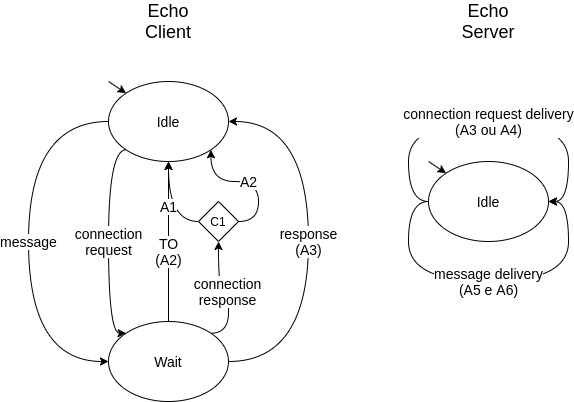

*Figura 1: entidades de protocolo cliente e servidor para aplicação de eco*

A **entidade de protocolo cliente** (*Echo Client*) possui os seguintes elementos:

Estados:

- Idle: é o estado inicial da aplicação. Após ser inicializado, o lado cliente aguarda que o usuário entre com uma informação a ser enviada.

- Wait: é o estado de espera. Após enviar uma requisição, o lado cliente aguarda a resposta do servidor. 

Eventos:

- connection request: ao ser inicializado, o lado cliente envia uma requisição de conexão ao lado servidor.

- connection response: resposta do servidor à conexão. O servidor aceita a conexão ou recusa a conexão quando o número de clientes conectados for maior que **n**. 

- message: representa o envio da mensagem ao servidor.

- response: representa o recebimento da resposta do servidor. 

- TO: *timeout*. Na ocorrência de falta de resposta a aplicação cliente é encerrada.

Ações: 

- A1: função de leitura é ativada na aplicação. O lado cliente fica aguardando que o usuário entre com uma mensagem a ser enviada. 

- A2: encerra o lado cliente. 

- A3: imprime na tela a resposta do servidor.

Condições:

- C1: executa (A1) se a conexão for aceita e (A2) caso contrário.

A **entidade de protocolo servidor** (*Echo Server*) possui os seguintes elementos:

Estados:

- Idle: é o estado inicial da aplicação. Após ser inicializado, o lado cliente aguarda que o usuário entre com uma informação a ser enviada.

Eventos:

- connection request delivery: representa a entrega da requisição de conexão no servidor.

- message delivery: representa a entrega da mensagem no servidor.

Ações: 

- A3: servidor aceita a conexão.

- A4: servidor recusa a conexão pelo limite **n** de clientes ter sido atingido. 

- A5: recebe a mensagem do cliente.

- A6: responde a mensagem do cliente. 

**OBS**: o DET apresentado contém uma versão simplificada da captura do funcionamento do protocolo. O recurso foi utilizado para apresentar a visão geral do funcionamento da aplicação e para facilitar a preparação dos testes e o levantamento de novos requisitos. 

O cenário abaixo representa o fluxo normal de execução do protocolo.

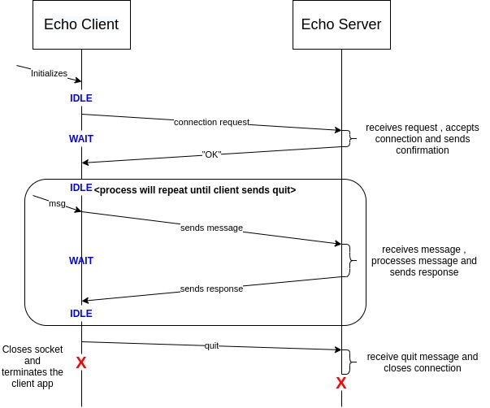

*Figura 2: cenário representando o fluxo normal de execução.*

#### Envio de mensagens

O envio de mensagens ao servidor será feito por meio de comandos, que serão enviados e processados pelo lado servidor da aplicação de echo. Os principais comandos são:

* Responde repetindo a mensagem
```console
> echo -m "<MESSAGE>"
```

* Responde a mensagem com eco
```console
> echo -e "<MESSAGE>"
```

* Encerra a aplicação cliente
```console
> quit
```
### Casos gerais de teste

Diante do exposto em seções anteriores, para verificar o correto funcionamento do protocolo implementado para a aplicação de eco, propõe-se a execução dos seguintes testes para os cenários que se seguem, abordando o estabelecimento da conexão, o envio de mensagens ao servidor de eco e encerramento da aplicação cliente:

- Estabelecimento da conexão

    1. Tentar conexão com servidor inativo
    2. Tentar conexão com servidor ativo
    3. Conectar **n** clientes ao servidor
    4. Tentar conexão após o número **n** de conexões ter sido atingido

* Envio de mensagens

    1. Tentar enviar uma mensagem ao servidor
    2. Enviar uma mensagem não entendível pelo servidor (`comando inválido`)

+ Encerramento da aplicação

    1. Enviar mensagem de encerramento ao servidor (`quit`) 
    2. Encerrar o servidor enquanto o cliente ainda está conectado e o envio de mensagens habilitado (`Crtl + c no lado servidor`)
    3. Encerrar o cliente sem informar o encerramento da aplicação (`Crtl + c no lado cliente`)

Os casos de teste listados acima representam os pontos críticos de funcionamento da aplicação de eco mediante os requisitos levantados. 

#### Teste 1.1 - Tentar conexão com servidor inativo

Para esse teste é esperado que a aplicação retorne uma mensagem informando que o servidor está fora do ar.

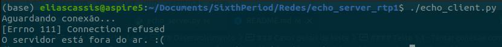

*Figura 3: Mensagem de servidor fora do ar exibida pela aplicação.*

#### Teste 1.2 - Tentar conexão com servidor ativo

Para esse teste é esperado que a aplicação retorne uma mensagem de boas-vindas, juntamente com uma breve instrução sobre os comandos aceitos pela mesma. Para esse teste a instância do servidor foi inicializada com apenas uma única _thread_.

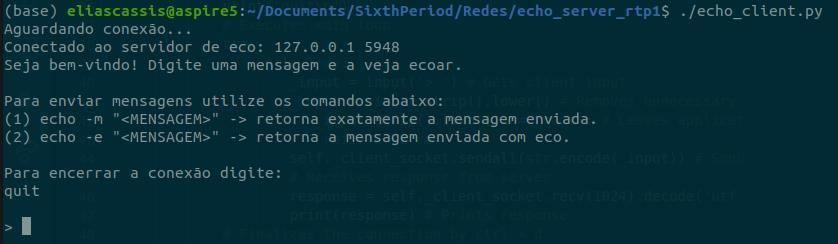

*Figura 4: Mensagem de boas-vindas exibida pela aplicação.*

#### Teste 1.3 - Conectar **n** clientes ao servidor

Para esse teste é esperado que **n** instâncias de clientes sejam conectadas com sucesso. Teste feito para $n = 3$.

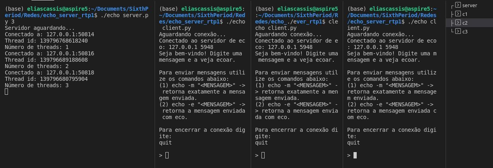

*Figura 5: Servidor aceitando 3 clientes com sucesso.*

#### Teste 1.4 - Conectar **n+1** clientes ao servidor

Para esse teste é esperado que **n** instâncias de clientes sejam conectadas com sucesso e uma mensagem de erro seja exibida para o cliente **n + 1** ao tentar conectar. Teste feito para $n = 1$.

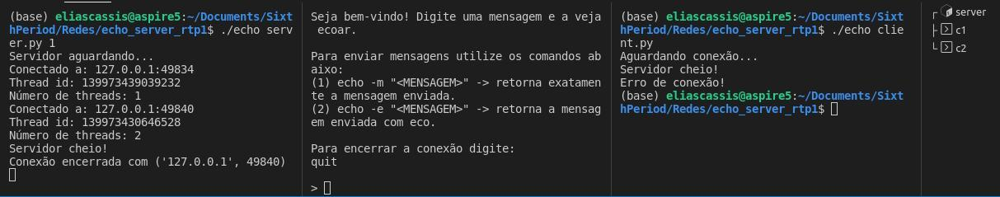

*Figura 6: Servidor recusando cliente após aceitar o número máximo de conexões.*

#### Teste 2.1 - Enviar uma mensagem ao servidor

Para esse teste é esperado que o servidor responda com a mensagem enviada pelo cliente; em acordo com a opção escolhida no comando (_-e_ ou _-m_).

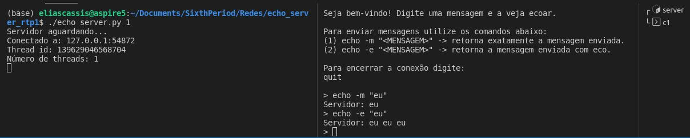

*Figura 7: Servidor respondendo a mensagens do cliente.*

#### Teste 2.2 - Enviar um comando inválido ao servidor

Para esse teste é esperado que o servidor informe as opções corretas de comandos quando o cliente enviar um comando inválido.

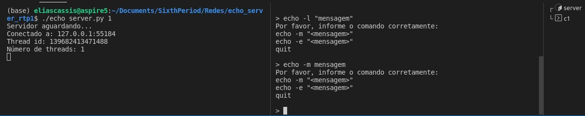

*Figura 8: Servidor informando sintaxe correta dos comandos ao cliente enviar um comando inválido.* 

#### Teste 3.1 - Enviar mensagem de encerramento ao servidor

Para esse teste é esperado que o servidor encerre a conexão e que o _socket_ do cliente seja fechado corretamente.

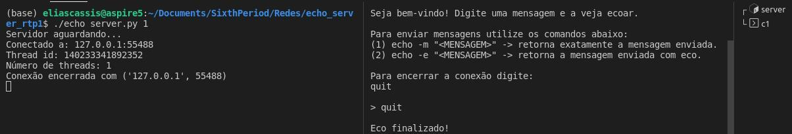

*Figura 9: Cliente sai da aplicação e a conexão é encerrada.* 

#### Teste 3.2 - Encerrar o servidor enquanto o cliente ainda está conectado e o envio de mensagens habilitado 

Para esse teste é esperado que a aplicação identifique um erro de conexão (após algumas tentativas de envio de mensagem) e encerre a aplicação no lado cliente.

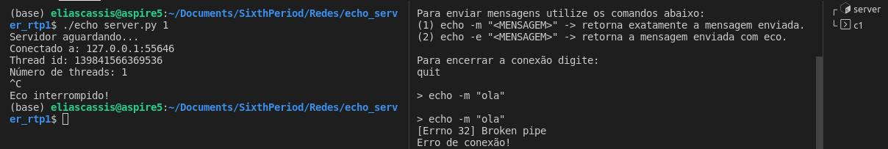

*Figura 10: Aplicação encerrada após erro de conexão com o servidor durante troca de mensagens.* 

#### Teste 3.3 - Encerrar o cliente sem informar o encerramento da aplicação 

Para esse teste é esperado que o servidor encerre a conexão como se o cliente tivesse executado o comando **quit**.

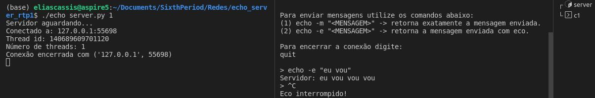

*Figura 11: Cliente sai da aplicação (`ctrl + c`) e a conexão é encerrada.* 

## Executando o código

Para executar a aplicação são necessárias **n + 1** instâncias de terminal. Uma das instâncias deve ser alocada para executar o código do servidor enquanto as demais **n** instâncias para o código cliente.

* Servidor
```console
> ./echo_server.py <número de threads>
```
* Cliente
```console
> ./echo_client.py
```

Após todas as instâncias desejadas estarem em execução, basta seguir as intruções apresentadas no _console_. As seções anteriores, durante a explicação do funcionamento e testes da aplicação, também possuem exemplos de execução e reprodução dos testes executados.

<!-- ### Módulos -->
